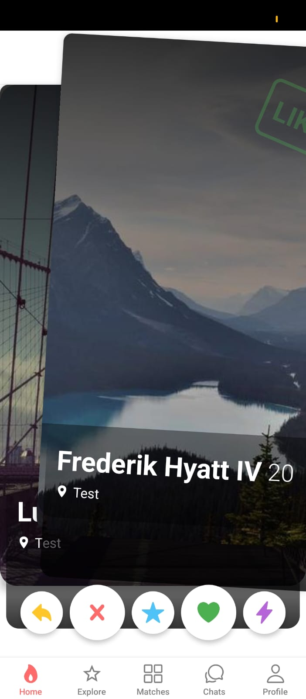
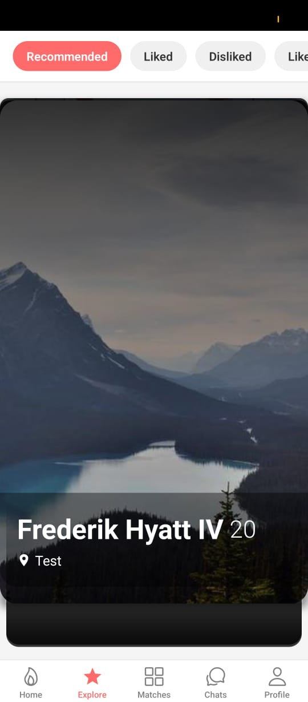
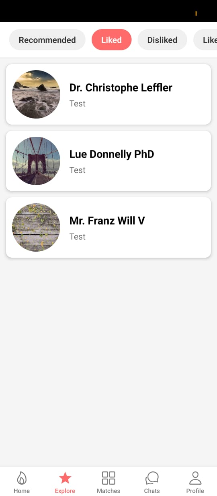
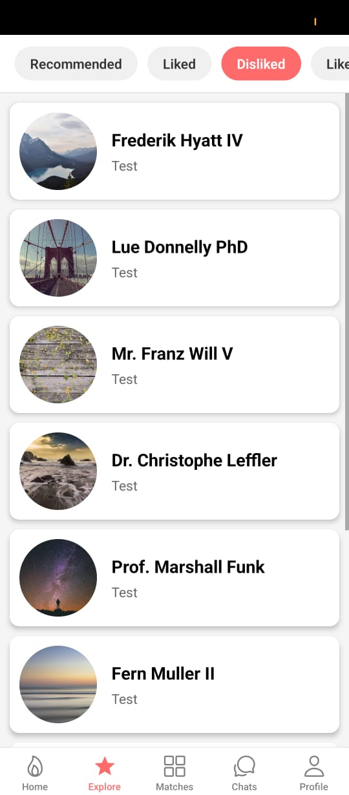
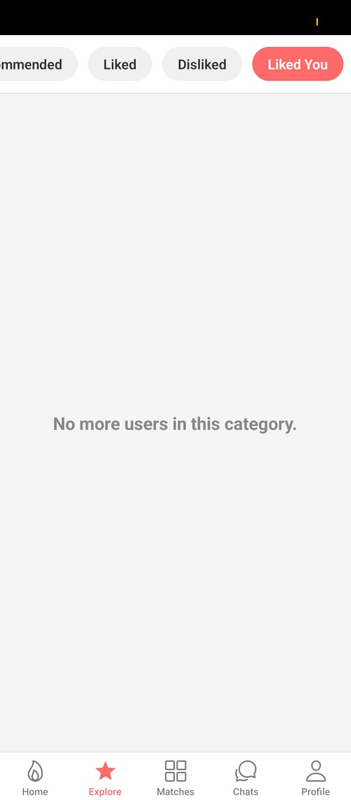
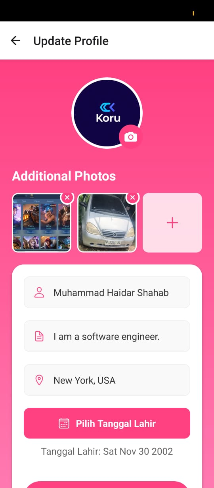
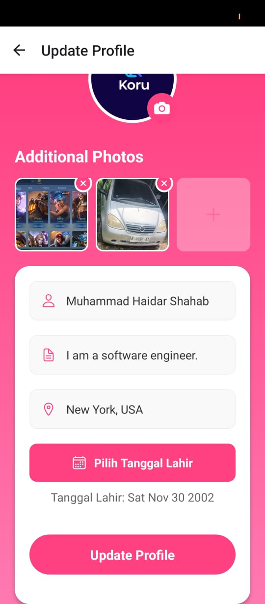

# Tinder Clone Frontend

This is the frontend for the Tinder clone application, built with React Native and Expo.

## Table of Contents

- [Getting Started](#getting-started)
  - [Prerequisites](#prerequisites)
  - [Installation](#installation)
  - [Running the App](#running-the-app)
- [Project Structure](#project-structure)
- [Configuration](#configuration)
- [Dependencies](#dependencies)

## Getting Started

### Prerequisites

- Node.js (v18 or later)
- npm or yarn
- Expo Go app on your mobile device or an Android/iOS emulator

### Installation

1. **Clone the repository:**

   ```bash
   git clone <repository-url>
   cd frontend-tinder
   ```

2. **Install dependencies:**

   ```bash
   pnpm install
   ```

### Running the App

1. **Start the development server:**

   ```bash
   pnpm start
   ```

2. **Scan the QR code** with the Expo Go app on your phone, or run on an emulator.

## Project Structure

```
frontend-tinder/
├── src/
│   ├── components/     # Reusable components
│   ├── navigation/     # Navigation setup
│   ├── screens/        # App screens
│   ├── services/       # API calls and other services
│   └── types/          # TypeScript types
├── .env                # Environment variables (create this file)
├── App.tsx             # Main app component
└── package.json        # Project dependencies and scripts
```

## Configuration

Create a `.env` file in the root of the `frontend-tinder` directory and add the following environment variable:

```
API_URL=http://your-backend-api-url/api
```

Replace `http://your-backend-api-url/api` with the actual URL of your backend API.

## Dependencies

- **@react-navigation/native**: Core navigation library
- **@react-navigation/stack**: Stack navigator
- **@tanstack/react-query**: Data fetching and caching
- **axios**: HTTP client
- **expo**: React Native framework
- **react-native-dotenv**: Loading environment variables from `.env`

---

## UI Screenshots

Below are some examples of the application's user interface.

<table>
  <tr>
    <td align="center"><strong>Splash Screen</strong></td>
    <td align="center"><strong>Register Details</strong></td>
    <td align="center"><strong>Login Details</strong></td>
    <td align="center"><strong>Swipe Screen</strong></td>
  </tr>
  <tr>
    <td align="center"></td>
    <td align="center"></td>
    <td align="center"></td>
    <td align="center"></td>
  </tr>
  <tr>
    <td align="center"><strong>Swipe Dislike</strong></td>
    <td align="center"><strong>Swipe Like</strong></td>
    <td align="center"><strong>Explore Page Recomendation</strong></td>
    <td align="center"><strong>Explore Page Liked</strong></td>
  </tr>
  <tr>
    <td align="center"></td>
    <td align="center"></td>
    <td align="center"></td>
    <td align="center"></td>
  </tr>
  <tr>
    <td align="center"><strong>Explore Page Dislike</strong></td>
    <td align="center"><strong>Explore Page Like You</strong></td>
    <td align="center"><strong>Profile Details</strong></td>
    <td align="center"><strong>Profile Details</strong></td>
  </tr>
  <tr>
    <td align="center"></td>
    <td align="center"></td>
    <td align="center"></td>
    <td align="center"></td>
  </tr>
  <tr>
    <td align="center"><strong>Profile Edit Page</strong></td>
    <td align="center"><strong>Profile Edit Page</strong></td>
    <td align="center">&nbsp;</td>
    <td align="center">&nbsp;</td>
  </tr>
  <tr>
    <td align="center"></td>
    <td align="center"></td>
    <td align="center">&nbsp;</td>
    <td align="center">&nbsp;</td>
  </tr>


</table>